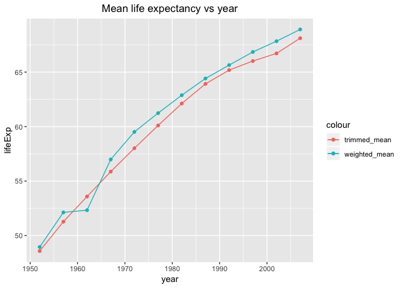
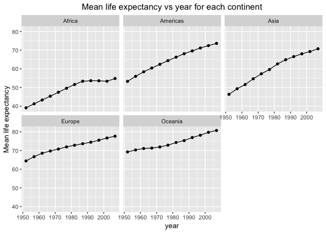

Homework 03: Use dplyr/ggplot2 to manipulate and explore data
================

## Bring rectangular data in

Work with the gapminder data we explored in class.

``` r
suppressPackageStartupMessages(library(tidyverse))
suppressPackageStartupMessages(library(gapminder))
suppressMessages(library(knitr))
```

### Task 1: Get the maximum and minimum of GDP per capita for all continents.

To get the maximum and minimum of GDP Percapita for all continents, use
`groupby()` to group the data by continents, then use `summarise()` with
max and min to get the values. To create the table, use `knitr::kable()`
as suggested by the instructor.`align = 'c'` to align the entries to
centre.

``` r
gdpPercap_table_1 <- gapminder %>% 
                      group_by(continent) %>% 
                      summarise(maxGdpPercap = max(gdpPercap),
                      minGdpPercap = min(gdpPercap))
knitr::kable(gdpPercap_table_1, align = 'c')
```

| continent | maxGdpPercap | minGdpPercap |
| :-------: | :----------: | :----------: |
|  Africa   |   21951.21   |   241.1659   |
| Americas  |   42951.65   |  1201.6372   |
|   Asia    |  113523.13   |   331.0000   |
|  Europe   |   49357.19   |   973.5332   |
|  Oceania  |   34435.37   |  10039.5956  |

To visualize the max and min gdpPercap for each continent, we can plot
the jitter points for gdpPercap vs continent and mark the maximum and
minimum. `scale_y_log10()` is used since gdpPercap has very large
values. `stat_summary()` can be used to plot max and min on the same
graph. [Resource for
stat\_summary()](https://ggplot2.tidyverse.org/reference/stat_summary.html)

``` r
gapminder %>% 
  ggplot(aes(continent, gdpPercap)) + 
  scale_y_log10() + 
  geom_jitter(aes(colour = continent), alpha = 0.2) + 
  stat_summary(fun.y = min, colour = "blue", geom = "point", size = 2) +
  stat_summary(fun.y = max, colour = "orange", geom = "point", size = 2)
```

<!-- -->

From the figure above, we can see the max and min GDP per capita for
each continent. Additionally, the data distribution can also be observed
which is similar as Task 2 below. It can also be noticed that the number
of data sets for Oceania is significantly smaller than other continents
which also makes sense.

### Task 2: Look at the spread of GDP per capita within the continents.

To get the spread of GDP per capita within all continents, we first need
to use `groupby()` to group the data by continents. Then use
`summarise()` to get several analysis.

``` r
gdpPercap_table_2 <- gapminder %>% 
                    group_by(continent) %>% 
                    summarise(minGdpPercap = max(gdpPercap),
                              maxGdpPercap = min(gdpPercap),
                              sdGdpPerxcap = sd(gdpPercap),
                              meanGdpPercap = mean(gdpPercap))
gdpPercap_table_2
```

    ## # A tibble: 5 x 5
    ##   continent minGdpPercap maxGdpPercap sdGdpPerxcap meanGdpPercap
    ##   <fct>            <dbl>        <dbl>        <dbl>         <dbl>
    ## 1 Africa          21951.         241.        2828.         2194.
    ## 2 Americas        42952.        1202.        6397.         7136.
    ## 3 Asia           113523.         331        14045.         7902.
    ## 4 Europe          49357.         974.        9355.        14469.
    ## 5 Oceania         34435.       10040.        6359.        18622.

To create the table, use `knitr::kable()` as suggested by the
instructor.`align = 'c'` to align the entries to
centre.

``` r
knitr::kable(gdpPercap_table_2, align = 'c')
```

| continent | minGdpPercap | maxGdpPercap | sdGdpPerxcap | meanGdpPercap |
| :-------: | :----------: | :----------: | :----------: | :-----------: |
|  Africa   |   21951.21   |   241.1659   |   2827.930   |   2193.755    |
| Americas  |   42951.65   |  1201.6372   |   6396.764   |   7136.110    |
|   Asia    |  113523.13   |   331.0000   |  14045.373   |   7902.150    |
|  Europe   |   49357.19   |   973.5332   |   9355.213   |   14469.476   |
|  Oceania  |   34435.37   |  10039.5956  |   6358.983   |   18621.609   |

To visualize the spread of gdpPercap within all continents, the violin
plot of gdpPercap vs continent can be used.Since gdpPercap has large
values, log scale can be used.

``` r
gapminder %>% 
  ggplot(aes(continent, gdpPercap)) + 
  scale_y_log10() + 
  geom_violin(aes(colour = continent)) + 
  geom_jitter(aes(colour = continent), alpha = 0.2)
```

<!-- -->

The violin plot gives a clear overview of data distribution and spread.
However, it doesn’t show the medium and mean values clearly. Instead,
box plot can be used for such purpose.

``` r
gapminder %>% 
  ggplot(aes(continent, gdpPercap)) + 
  scale_y_log10() + 
  geom_boxplot(aes(colour = continent)) + 
  geom_jitter(aes(colour = continent), alpha = 0.2)
```

<!-- -->

In conclusion, the violin plot gives better view in terms of data
spread. Box plot gives a clear view of mean, max and min instead. They
can be chosen by specific
purpose.

### Task 3: Compute a trimmed mean of life expectancy for different years. Or a weighted mean, weighting by population.

To calculated trimmed mean, `mean(x, trim = 0, na.rm = FALSE, …)` can be
used. I used trim = 0.1. For weighted mean, `weighted.mean(x, w, ...,
na.rm = FALSE)` can be used.

``` r
gapminder %>% 
  group_by(year) %>% 
  summarise(trimmed_mean = mean(lifeExp, trim = 0.1),
            weighted_mean = weighted.mean(lifeExp, pop)) %>% 
  knitr::kable(align = 'c')
```

| year | trimmed\_mean | weighted\_mean |
| :--: | :-----------: | :------------: |
| 1952 |   48.57668    |    48.94424    |
| 1957 |   51.26888    |    52.12189    |
| 1962 |   53.58075    |    52.32438    |
| 1967 |   55.86538    |    56.98431    |
| 1972 |   58.01444    |    59.51478    |
| 1977 |   60.10206    |    61.23726    |
| 1982 |   62.11694    |    62.88176    |
| 1987 |   63.92106    |    64.41635    |
| 1992 |   65.18519    |    65.64590    |
| 1997 |   66.01736    |    66.84934    |
| 2002 |   66.71641    |    67.83904    |
| 2007 |   68.11489    |    68.91909    |

To visualize the data, line plot with points can be used.

``` r
gapminder %>% 
  group_by(year) %>% 
  summarise(trimmed_mean = mean(lifeExp, trim = 0.1),
            weighted_mean = weighted.mean(lifeExp, pop)) %>% 
  ggplot() +
  geom_line(aes(year, trimmed_mean, colour = "trimmed_mean")) + 
  geom_line(aes(year, weighted_mean, colour = "weighted_mean")) + 
  geom_point(aes(year, trimmed_mean, colour = "trimmed_mean")) + 
  geom_point(aes(year, weighted_mean, colour = "weighted_mean")) + 
  labs(x = "year", y = "lifeExp")
```

<!-- -->

From the plot above, the lifeExp grows with year but with slight
differences between trimmed mean and weighted
mean.

### Task 4: How is life expectancy changing over time on different continents?

To get the life expectancy change over time on different continents,
first we need to calculate the mean lifeExp for each continent in each
year.

``` r
lifeExpChange <- gapminder %>% 
                  group_by(continent, year) %>% 
                  summarise(mean = mean(lifeExp)) %>% 
                  mutate(change_by_previous = mean - lag(mean))
continentLifeExpChange <- split(lifeExpChange, lifeExpChange$continent)

for (i in 1:length(continentLifeExpChange)){
    print(kable(continentLifeExpChange[[i]], align = 'c'))
}
```

    ## 
    ## 
    ##  continent    year      mean      change_by_previous 
    ## -----------  ------  ----------  --------------------
    ##   Africa      1952    39.13550            NA         
    ##   Africa      1957    41.26635        2.1308462      
    ##   Africa      1962    43.31944        2.0530962      
    ##   Africa      1967    45.33454        2.0150962      
    ##   Africa      1972    47.45094        2.1164038      
    ##   Africa      1977    49.58042        2.1294808      
    ##   Africa      1982    51.59287        2.0124423      
    ##   Africa      1987    53.34479        1.7519231      
    ##   Africa      1992    53.62958        0.2847885      
    ##   Africa      1997    53.59827        -0.0313077     
    ##   Africa      2002    53.32523        -0.2730385     
    ##   Africa      2007    54.80604        1.4808077      
    ## 
    ## 
    ##  continent    year      mean      change_by_previous 
    ## -----------  ------  ----------  --------------------
    ##  Americas     1952    53.27984            NA         
    ##  Americas     1957    55.96028         2.68044       
    ##  Americas     1962    58.39876         2.43848       
    ##  Americas     1967    60.41092         2.01216       
    ##  Americas     1972    62.39492         1.98400       
    ##  Americas     1977    64.39156         1.99664       
    ##  Americas     1982    66.22884         1.83728       
    ##  Americas     1987    68.09072         1.86188       
    ##  Americas     1992    69.56836         1.47764       
    ##  Americas     1997    71.15048         1.58212       
    ##  Americas     2002    72.42204         1.27156       
    ##  Americas     2007    73.60812         1.18608       
    ## 
    ## 
    ##  continent    year      mean      change_by_previous 
    ## -----------  ------  ----------  --------------------
    ##    Asia       1952    46.31439            NA         
    ##    Asia       1957    49.31854         3.004150      
    ##    Asia       1962    51.56322         2.244679      
    ##    Asia       1967    54.66364         3.100417      
    ##    Asia       1972    57.31927         2.655629      
    ##    Asia       1977    59.61056         2.291287      
    ##    Asia       1982    62.61794         3.007383      
    ##    Asia       1987    64.85118         2.233242      
    ##    Asia       1992    66.53721         1.686030      
    ##    Asia       1997    68.02052         1.483303      
    ##    Asia       2002    69.23388         1.213364      
    ##    Asia       2007    70.72848         1.494606      
    ## 
    ## 
    ##  continent    year      mean      change_by_previous 
    ## -----------  ------  ----------  --------------------
    ##   Europe      1952    64.40850            NA         
    ##   Europe      1957    66.70307        2.2945667      
    ##   Europe      1962    68.53923        1.8361667      
    ##   Europe      1967    69.73760        1.1983667      
    ##   Europe      1972    70.77503        1.0374333      
    ##   Europe      1977    71.93777        1.1627333      
    ##   Europe      1982    72.80640        0.8686333      
    ##   Europe      1987    73.64217        0.8357667      
    ##   Europe      1992    74.44010        0.7979333      
    ##   Europe      1997    75.50517        1.0650667      
    ##   Europe      2002    76.70060        1.1954333      
    ##   Europe      2007    77.64860        0.9480000      
    ## 
    ## 
    ##  continent    year     mean      change_by_previous 
    ## -----------  ------  ---------  --------------------
    ##   Oceania     1952    69.2550            NA         
    ##   Oceania     1957    70.2950          1.0400       
    ##   Oceania     1962    71.0850          0.7900       
    ##   Oceania     1967    71.3100          0.2250       
    ##   Oceania     1972    71.9100          0.6000       
    ##   Oceania     1977    72.8550          0.9450       
    ##   Oceania     1982    74.2900          1.4350       
    ##   Oceania     1987    75.3200          1.0300       
    ##   Oceania     1992    76.9450          1.6250       
    ##   Oceania     1997    78.1900          1.2450       
    ##   Oceania     2002    79.7400          1.5500       
    ##   Oceania     2007    80.7195          0.9795

From the tables, most of the changes are positive. We can see that it is
always increasing other than 1997 and 2002 in Africa. The amount of
increment can also be observed

To visualize the data, we can plot the mean of lifeExp of each year and
facet by continent.

``` r
lifeExpChange
```

    ## # A tibble: 60 x 4
    ## # Groups:   continent [5]
    ##    continent  year  mean change_by_previous
    ##    <fct>     <int> <dbl>              <dbl>
    ##  1 Africa     1952  39.1            NA     
    ##  2 Africa     1957  41.3             2.13  
    ##  3 Africa     1962  43.3             2.05  
    ##  4 Africa     1967  45.3             2.02  
    ##  5 Africa     1972  47.5             2.12  
    ##  6 Africa     1977  49.6             2.13  
    ##  7 Africa     1982  51.6             2.01  
    ##  8 Africa     1987  53.3             1.75  
    ##  9 Africa     1992  53.6             0.285 
    ## 10 Africa     1997  53.6            -0.0313
    ## # ... with 50 more rows

``` r
ggplot(lifeExpChange) + 
  facet_wrap(~ continent, scale = "fixed") + 
  geom_line(aes(year, mean)) + 
  geom_point(aes(year, mean))
```

<!-- -->

Another way is to use `geom_smooth()` to show the trend without
computing the mean. `geom_line()` and `geom_point()` with facet by
continent can be used to visualize the life expectancy changing over
time on different continents. Use `geom_smooth()` with `method =
"auto"`, the trend of life expectancy changing over time can be shown.
For method = “auto” the smoothing method is chosen based on the size of
the largest group (across all panels).

``` r
ggplot(gapminder, aes(year, lifeExp)) + 
  facet_wrap( ~ continent) + 
  geom_point(alpha = 0.2) +
  geom_smooth(method = "auto", se=FALSE)
```

    ## `geom_smooth()` using method = 'loess' and formula 'y ~ x'

<!-- -->

## But I want to do more\!

### Layout stretch goal: get table and figure side-by-side.

Tried the approach by css but not working. Didn’t find a solution for
table and figure side by side.

However, found a solution for table and table side by side:
[stackoverflow
answer](https://stackoverflow.com/questions/17717323/align-two-data-frames-next-to-each-other-with-knitr)

``` r
t1 = kable(gdpPercap_table_1, format='html', output = FALSE)
t2 = kable(gdpPercap_table_2, format='html', output = FALSE)
f1 = ggplot(gapminder,aes(year, gdpPercap)) + geom_line()
cat(c('<table><tr valign="top"><td>', t1, '</td><td>', t2, '</td><tr></table>'),
    sep = '')
```

<table>

<tr valign="top">

<td>

<table>

<thead>

<tr>

<th style="text-align:left;">

continent

</th>

<th style="text-align:right;">

maxGdpPercap

</th>

<th style="text-align:right;">

minGdpPercap

</th>

</tr>

</thead>

<tbody>

<tr>

<td style="text-align:left;">

Africa

</td>

<td style="text-align:right;">

21951.21

</td>

<td style="text-align:right;">

241.1659

</td>

</tr>

<tr>

<td style="text-align:left;">

Americas

</td>

<td style="text-align:right;">

42951.65

</td>

<td style="text-align:right;">

1201.6372

</td>

</tr>

<tr>

<td style="text-align:left;">

Asia

</td>

<td style="text-align:right;">

113523.13

</td>

<td style="text-align:right;">

331.0000

</td>

</tr>

<tr>

<td style="text-align:left;">

Europe

</td>

<td style="text-align:right;">

49357.19

</td>

<td style="text-align:right;">

973.5332

</td>

</tr>

<tr>

<td style="text-align:left;">

Oceania

</td>

<td style="text-align:right;">

34435.37

</td>

<td style="text-align:right;">

10039.5956

</td>

</tr>

</tbody>

</table>

</td>

<td>

<table>

<thead>

<tr>

<th style="text-align:left;">

continent

</th>

<th style="text-align:right;">

minGdpPercap

</th>

<th style="text-align:right;">

maxGdpPercap

</th>

<th style="text-align:right;">

sdGdpPerxcap

</th>

<th style="text-align:right;">

meanGdpPercap

</th>

</tr>

</thead>

<tbody>

<tr>

<td style="text-align:left;">

Africa

</td>

<td style="text-align:right;">

21951.21

</td>

<td style="text-align:right;">

241.1659

</td>

<td style="text-align:right;">

2827.930

</td>

<td style="text-align:right;">

2193.755

</td>

</tr>

<tr>

<td style="text-align:left;">

Americas

</td>

<td style="text-align:right;">

42951.65

</td>

<td style="text-align:right;">

1201.6372

</td>

<td style="text-align:right;">

6396.764

</td>

<td style="text-align:right;">

7136.110

</td>

</tr>

<tr>

<td style="text-align:left;">

Asia

</td>

<td style="text-align:right;">

113523.13

</td>

<td style="text-align:right;">

331.0000

</td>

<td style="text-align:right;">

14045.373

</td>

<td style="text-align:right;">

7902.150

</td>

</tr>

<tr>

<td style="text-align:left;">

Europe

</td>

<td style="text-align:right;">

49357.19

</td>

<td style="text-align:right;">

973.5332

</td>

<td style="text-align:right;">

9355.213

</td>

<td style="text-align:right;">

14469.476

</td>

</tr>

<tr>

<td style="text-align:left;">

Oceania

</td>

<td style="text-align:right;">

34435.37

</td>

<td style="text-align:right;">

10039.5956

</td>

<td style="text-align:right;">

6358.983

</td>

<td style="text-align:right;">

18621.609

</td>

</tr>

</tbody>

</table>

</td>

<tr>

</table>

### Table stretch goal: there are some really nice fancy table helper packages

``` r
library(pander)
panderOptions("table.style", "multiline")  # The default
pander(gdpPercap_table_2)
```

| continent | minGdpPercap | maxGdpPercap | sdGdpPerxcap | meanGdpPercap |
| :-------: | :----------: | :----------: | :----------: | :-----------: |
|  Africa   |    21951     |    241.2     |     2828     |     2194      |
| Americas  |    42952     |     1202     |     6397     |     7136      |
|   Asia    |    113523    |     331      |    14045     |     7902      |
|  Europe   |    49357     |    973.5     |     9355     |     14469     |
|  Oceania  |    34435     |    10040     |     6359     |     18622     |

``` r
panderOptions("table.style", "grid")
pander(gdpPercap_table_2)
```

<table>
<colgroup>
<col style="width: 16%" />
<col style="width: 20%" />
<col style="width: 20%" />
<col style="width: 20%" />
<col style="width: 21%" />
</colgroup>
<thead>
<tr class="header">
<th>continent</th>
<th>minGdpPercap</th>
<th>maxGdpPercap</th>
<th>sdGdpPerxcap</th>
<th>meanGdpPercap</th>
</tr>
</thead>
<tbody>
<tr class="odd">
<td>Africa</td>
<td>21951</td>
<td>241.2</td>
<td><pre><code>2828</code></pre></td>
<td><pre><code>2194</code></pre></td>
</tr>
<tr class="even">
<td>Americas</td>
<td>42952</td>
<td><pre><code>1202</code></pre></td>
<td><pre><code>6397</code></pre></td>
<td><pre><code>7136</code></pre></td>
</tr>
<tr class="odd">
<td>Asia</td>
<td>113523</td>
<td><pre><code>331</code></pre></td>
<td>14045</td>
<td><pre><code>7902</code></pre></td>
</tr>
<tr class="even">
<td>Europe</td>
<td>49357</td>
<td>973.5</td>
<td><pre><code>9355</code></pre></td>
<td><pre><code>14469</code></pre></td>
</tr>
<tr class="odd">
<td>Oceania</td>
<td>34435</td>
<td>10040</td>
<td><pre><code>6359</code></pre></td>
<td><pre><code>18622</code></pre></td>
</tr>
</tbody>
</table>
